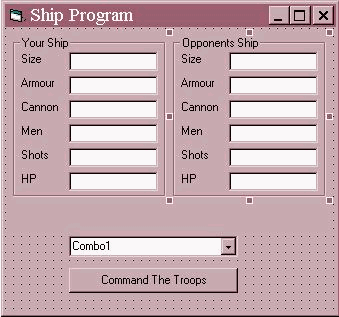

## Beginner's Guide to Intermediate Visual Basic

### Description

This will teach you things about: Variables, Operators, Conditional Statements, and Combo/List Boxes It will show you how to make a small game in VB. If you like it or it helps you, then vote for it!
 
### More Info
 

             |
---                |---
**Submitted On**   |2001-09-18 11:53:12
**By**             |[Sean Murphy](https://github.com/Planet-Source-Code/PSCIndex/blob/master/ByAuthor/sean-murphy.md)
**Level**          |Beginner
**User Rating**    |4.2 (21 globes from 5 users)
**Compatibility**  |VB 6\.0
**Category**       |[Miscellaneous](https://github.com/Planet-Source-Code/PSCIndex/blob/master/ByCategory/miscellaneous__1-1.md)
**World**          |[Visual Basic](https://github.com/Planet-Source-Code/PSCIndex/blob/master/ByWorld/visual-basic.md)
**Archive File**   |[Beginner's266239182001\.zip](https://github.com/Planet-Source-Code/sean-murphy-beginner-s-guide-to-intermediate-visual-basic__1-27348/archive/master.zip)

